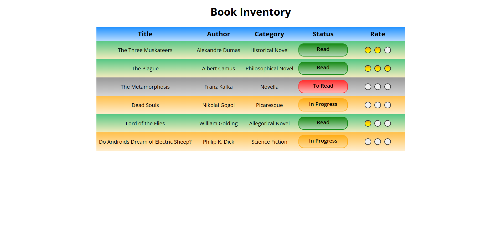

# 📁 Book Inventory App

## ℹ️ PROJECT SUBTITLE

This beginner-friendly project displays a book inventory in a clean table layout using only HTML and CSS. I created this as part of the [**freeCodeCamp.org**](https://www.freecodecamp.org/learn/full-stack-developer/) CSS course to practice semantic HTML and visual presentation.

---

## 🔍 Overview

This project demonstrates how to present data clearly in a tabular format using semantic HTML elements and creative CSS design. Each row of the table represents a book, including its title, author, category, status, and a visual rating bubble using gradients.

The table is color-coded by reading status — _Read_, _In Progress_, and _To Read_ — to enhance readability which also features accessibility.

---

## ✨ Features

- 📚 Table-based book inventory layout
- 🎨 Row backgrounds color-coded by reading status
- 🌟 Visual 3-dot rating system using gradients
- ♿ Semantic HTML and accessible markup

---

## 🧠 What I Learned

- Structuring and styling HTML tables
- Using CSS gradients for visual indicators
- Creating reusable design tokens with `:root` variables
- Accessible and semantic markup best practices
- Applying styling using class-based logic

---

## 🛠️ Tech Used

- HTML5
- CSS3

---

## 🚀 How to Run

1. Clone the repository
2. Navigate to this project folder
3. Open `index.html` in your browser

---

## 🌐 Live Demo

Or you can check out the 👉 [live website here](https://html-css-daily.netlify.app/build%20a%20book%20inventory%20app/)

---

## 🧑‍💻 Author

Created by **Elmar Chavez**

🗓️ Month/Year: **May 2025**

📚 Journey: **2nd** month of learning _frontend web development_.
